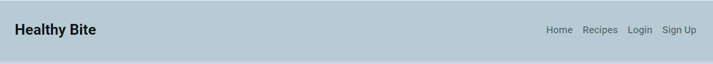
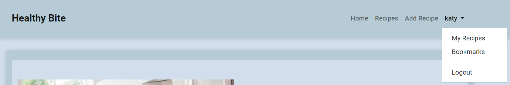

# Healthy Bite

**Healthy Bite** is a blog designed to make it easier for users to discover, share, and manage healthy food recipes. Whether you're looking for nutritious meal ideas or want to contribute your own recipes, this platform offers an intuitive interface to explore a world of healthy eating.

Users can sign up, search for healthy recipes, add their own creations, and engage with others by liking and commenting on recipes. It’s the perfect place for food lovers to share their passion for nutritious and wholesome meals!

You can visit the live version of the blog here: [Healthy Bite](https://tgo-healthy-bite-bc4b5d66896a.herokuapp.com/)

## Table of Contents

## User Experience (UX)

Visitors to Healthy Bite are health-conscious individuals who enjoy discovering new, nutritious recipes. They want to save time while also eating healthy, balanced meals. The platform allows users to easily search for, share, and save healthy recipes.

### User Stories

#### EPIC | User Profile
- As a User, I can sign up and log in to create, edit, and delete my recipes, as well as like and comment on others' recipes.
- As a User, I can see my login status and manage my account securely.

#### EPIC | Recipe Discovery
- As a User, I can search for healthy recipes.
- As a User, I can browse and like recipes to keep track of the ones I enjoy.
- As a User, I can view recipe details, including ingredients, preparation steps, and cooking time.

#### EPIC | Recipe Management
- As a User, I can add new recipes, including ingredients, cooking methods, and images.
- As a User, I can edit or delete my own recipes.
- As a User, I can manage my saved recipes in a personal space.

#### EPIC | Recipe Interaction
- As a User, I can like and comment on other users' recipes, helping to create a collaborative community.
- As a User, I can edit or delete my comments on others' recipes.

### Design

The website is designed to be visually appealing, with a calming and clean interface that encourages healthy living and mindful eating.

#### Colour Scheme

Colour palette from Coolors

The site uses a soft, natural color palette featuring light blue, light green, and whites to reflect the healthy, organic theme of the platform.

#### Fonts
The primary font used is **Roboto**, used for headers and contents. A clean and modern font that enhance readability while providing a stylish look.

## Features

### Header

- The header contains the Healthy Bite logo and navigation links for recipes, home page. Login and Signup status.

**Navigation Bar**

- The navigation bar is prrsent at the top of every page and includes all links to various pages.
- Under username displayed at top right, a dropdown menu show the options to a logged user to browser their own recipes and bookmarded recipes. 

### Footer

- The footer section includes links to Facebook, Twitter and instagram.
- Clicking the links in the footer opens a separate browser tab to avoid pulling the user away from the site.

### Home Page

**Call to Action Section**

- The home page includes a call to action section which encourages the user to sign up to the site with the message "Discover the Joy of Healthy Eating!" and an image of a family dinner.
- the page includes a signup button whish takes the user to the signup page.

- When the user login the page display a "Welocome back to Healthy Bite!" with a button to create a Recipe.
- By clicking on the button the page redirects the user to add recipe page.

### User Account Pages

**Sign Up**

**Log In**

**Log Out**

- Django allauth was installed and used to create the Sign up, Log in and Log out functionality.
- A Success messafes display to user when they have logged in/ logged ou successfully.

### Recipes

- This Page displays all recipes with a clear recipe titles, cook time and images. 
- The recipes cards are paginated every 8 recipes.
- Clicking in View Recipe button on the recipe cards, it will redirect the user to recipes detailed page.

### Recipes Details

- When the recipe is clicked the header shows the recipe tiltle, created by and cook time for that recipe.

Also, when the user click to View recipes a ingredients  and instructions are displayed informing the user what need to prep that recipe.

**Comments Section**

- Below the instructions a comment card is displayed with recents comments, and if the user left a comment before they are able to edit/ delete their own comments. 

- If the user wnats to leave a comment they are allowed to submit their comment, and a display message will appear "Your comment is awaiting approval" 

- If the comment is aproved by the admin and the user wnats to update their comments, clicking on the edit button will redirect to the comment edit page.

- If the user wants to delete their own comments, clicking on the delete button, will redirect to Delete Comment page.

### Add Recipe Form

- If the user is logged in, then they can add a recipe by clicking the link on the navigation bar.
- The form fields for 'Ingredients' and 'Instructions' include a WYSIWYG editor called Summernote to help the user format their content by adding bullet points, headings etc.
- The user can upload a photo if they wish. If they choose not to, a default image displays as their recipe image.
- The user can choose to publish the recipe now or draft for later through a drop down menu. If they choose to 'Draft', the recipe will not appear on the Recipes page but the user will be able to access it in their 'My Recipes' page and it will be labelled as 'DRAFT'.
- Failing to fill out the recipe's Title, Description, instructions, results in the form failing and rendering a message stating which fields you have missed.

### Update Recipe Form

- If the user is logged in and is the author or the recipe they can choose to edit the recipe by clicking the edit button on the recipe detail page. 
- The form opens with all fields populated with the original content.
- the users can update and save their own recipes successfully.

### Delete Recipe

 

- If the user is logged in and is the author or the recipe they can choose to delete the recipe by clicking the delete button on the recipe detail page.  
- The user is asked to confirm if they wish to delete the recipe or cancel.

### My Recipes Page

- This page displays all recipes which the logged in user has created.
- The recipe cards are paginated after every 6 recipes. 
- Each card displays the recipe's image and Title. 
- Clicking View recipe card will take you directly to that recipe's detailed page.

### My Bookmarks Page

- This page displays all recipes which the logged in user has added to their bookmarks.
- Clicking View recipe card will take you directly to that recipe's detailed page.
- If a user wants to remove bookmark recipes, a "Remove Nookmark" is displayed under "View Recipes"

### Custom Error Pages
Custom error pages were designed for a better user experience, provinding them with butons to get them back to the site.

- 400 Bad Request - Oops! It seems there was an error with your request. Please check your input and try again
- 403 Page Forbidden - Sorry, you don't have permission to access this page.
- 404 Page Not Found - The page you're looking for doesn't exist.
- 500 Server Error - Something went wrong on our end. Please try again later.

### Future Features

## Deployment - Heroku
To deploy this page to Heroku from its GitHub repository, the following steps were taken:

### Create the Heroku App:
- Log in to [Heroku](https://dashboard.heroku.com/apps) or create an account.
- On the main page click the button labelled New in the top right corner and from the drop-down menu select "Create New App".
- Enter a unique and meaningful app name.
- Next select your region.
- Click on the Create App button

### Update Heroku Config Vars
Add the following Config Vars in Heroku:
- SECRET_KEY value 
- CLOUDINARY_URL
- PORT = 8000
- DISABLE_COLLECTSTATIC = 1

### Deploy

- NB: Ensure in Django settings, DEBUG is False
- Set up a Heroku account and create a new app.
- Attach the Heroku Postgres add-on for database support.
- Configure environment variables like `SECRET_KEY` and `DATABASE_URL`.
- Use `gunicorn` as the web server in the `Procfile`.
- Deploy the project via GitHub or manually using Heroku CLI.

## Forking this repository

1. Visit [Healthy Bite GitHub Repository](https://github.com/thiago-23/Healthy_Bite.git).
2. Click the "Fork" button in the top-right corner of the page.
3. Follow the instructions to fork the project.

## Cloning this repository

To clone this repository follow the below steps: 

1. Locate the repository at this link [Healthy Bite GitHub Repository](https://github.com/thiago-23/Healthy_Bite.git). 
2. Under **'Code'**, see the different cloning options, HTTPS, SSH, and GitHub CLI. Click the prefered cloning option, and then copy the link provided. 
3. Open **Terminal**.
4. In Terminal, change the current working directory to the desired location of the cloned directory.
5. Type **'git clone'**, and then paste the URL copied from GitHub earlier. 
6. Type **'Enter'** to create the local clone. 

## Languages

- Python
- HTML
- CSS
- Javascript

## Frameworks - Libraries - Programs Used

- [Django](https://www.djangoproject.com/): for backend functionality.
- [Django-allauth](https://django-allauth.readthedocs.io/en/latest/installation.html): authentication library used to create the user accounts
- [PostgreSQL](https://www.postgresql.org/) for database management.
- [Heroku](https://dashboard.heroku.com/login) - for deployment.
- [Font Awesome](https://fontawesome.com/) - Used for icons.
- [GitHub](https://github.com/) - Used for version control and agile tool.
- [Google Fonts](https://fonts.google.com/) - Used to import and alter fonts on the page.
- [W3C](https://www.w3.org/) - Used for HTML & CSS Validation.
- [PEP8 Online](http://pep8online.com/) - used to validate all the Python code
- [Jshint](https://jshint.com/) - used to validate javascript
- [Coolors](https://coolors.co/) - Used to create colour palette.
- [Favicon](https://favicon.io/) - Used to create the favicon.
- [Lucidchart](https://lucid.app/documents#/dashboard) - used to create the database schema design
- [Summernote](https://summernote.org/): for rich text editing in forms.
- [Crispy Forms](https://django-crispy-forms.readthedocs.io/en/latest/) used to manage Django Forms
- [Cloudinary](https://cloudinary.com/): the image hosting service used to upload images
- [Bootstrap 4.6](https://getbootstrap.com/docs/4.6/getting-started/introduction/): for responsive design.and styling

## Credits

* [IStock](https://www.istockphoto.com/)
* [Font awesome](https://fontawesome.com/icons)
* [Iconmonstr](https://iconmonstr.com/?s=coffee)
* [Coolors](https://coolors.co/)
* [Google Fonts](https://fonts.google.com/)
* [Mockup Screenshot Generator](https://ui.dev/amiresponsive)
- [W3Schools](https://www.w3schools.com/)
- [Django Docs](https://docs.djangoproject.com/en/4.0/)
- [Bootstrap 4.6 Docs](https://getbootstrap.com/docs/4.6/getting-started/introduction/)
- [Stack Overflow](https://stackoverflow.com/)
- [Code Institute - Blog Walkthrough Project](https://github.com/Code-Institute-Solutions/Django3blog)

## Acknowledgments

Thanks to my mentor, Antonio for his advice and support during my project, and the Code Institute Slack community for their support.